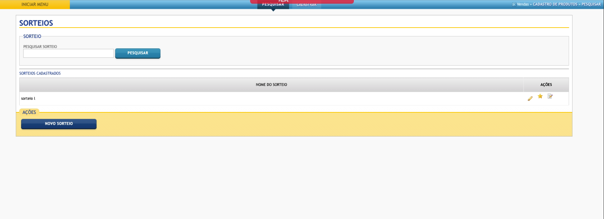
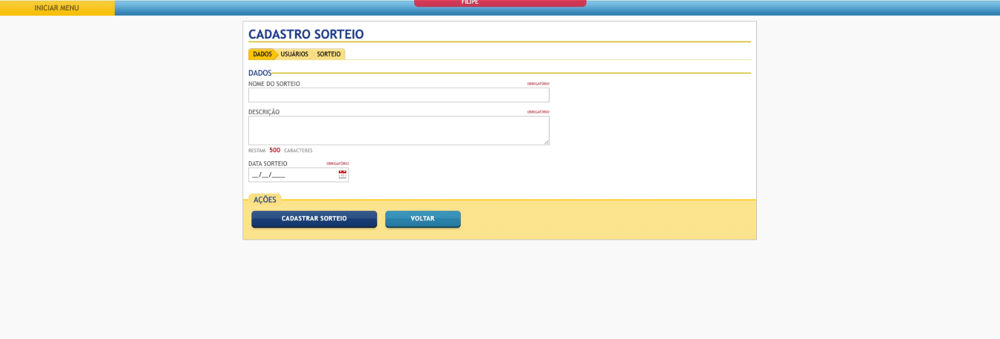

### Funcionalidade de Sorteio
Uma funcionalidade para cadastrado/execução de sorteios.

### 📫Objetivos:
 
- Pesquisa de Sorteios;
- Cadastro de Sorteios;
- Inserção de Participantes;
- Realização de Sorteio;
- Edição de Sorteios;
- Gerenciamento de Participantes Premiados;
- Navegação Intuitiva.

### 📷Screenshots:

    
Clique aqui para expandir

    
    
    
    
    

### 🖥️ Tecnologias e Ferramentas utilizadas: 

<code></code>
<code></code>
<code></code>
<code></code>
<code></code>
<code></code>
<code></code>
<code></code>

### O código SQL para criar as tabelas está disponível [aqui](https://github.com/Lipepimenta/Func_Sorteio/model/sorteio.php).
